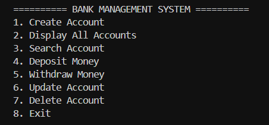
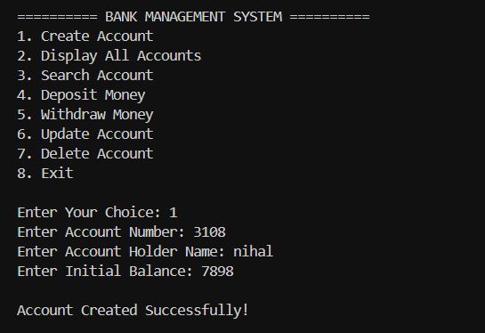
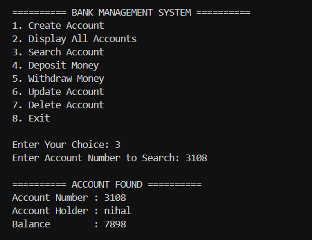
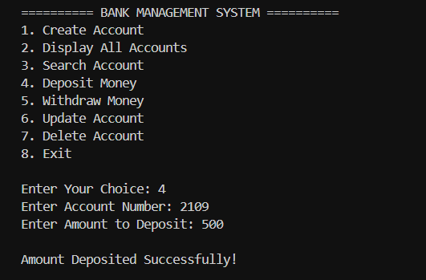
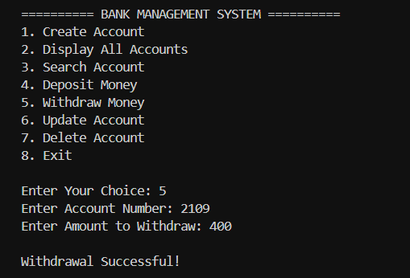
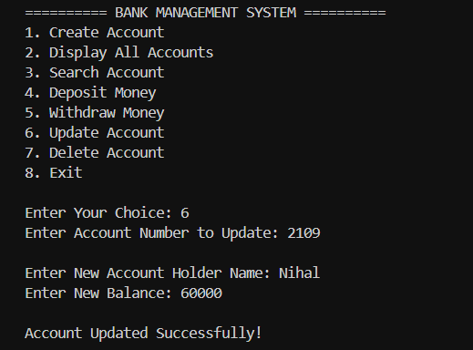
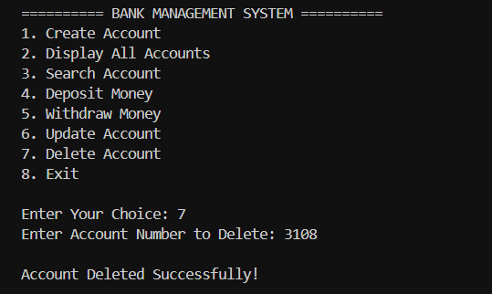

# Banking Management System Basic

A console-based Banking Management System developed using C++ using Object-Oriented Programming (OOP) and File Handling concepts.

This project simulates core banking operations such as account creation, searching accounts, depositing money, withdrawing money, updating customer records, and deleting accounts while permanently storing data using text files.

The project was built to strengthen practical understanding of:
- C++ Programming
- OOP Concepts
- File Handling
- CRUD Operations
- Data Persistence
- Git & GitHub Workflow

---

# Features

## Account Management
- Create New Account
- Prevent Duplicate Account Numbers
- Search Account by Account Number
- Display All Accounts
- Update Existing Account Details
- Delete Existing Account

## Banking Operations
- Deposit Money
- Withdraw Money
- Balance Management
- Insufficient Balance Detection

## System Features
- Persistent Data Storage using File Handling
- Menu-Driven Console Interface
- Temporary File Replacement Technique
- Structured OOP-based Code
- Transaction History Logging
- Search Account by Name
- Export Account Report
- Basic Exception Handling

---

# Technologies Used

| Technology | Purpose |
|---|---|
| C++ | Core Programming Language |
| OOP | Program Structure |
| File Handling (`fstream`) | Data Storage |
| VS Code | Development Environment |
| Git | Version Control |
| GitHub | Project Hosting |

---

# C++ Concepts Implemented

## Object-Oriented Programming
- Classes & Objects
- Encapsulation
- Member Functions
- Access Specifiers

## Core Programming Concepts
- Functions
- Loops
- Conditional Statements
- Strings
- User Input Handling

## File Handling Concepts
- `ifstream`
- `ofstream`
- Reading Files
- Writing Files
- Appending Data
- Updating Records using Temporary Files

---

# Project Structure

```plaintext
Banking-Management-System-Basic/
│
├── main.cpp
├── accounts.txt
├── README.md
├── .gitignore
├── bank.exe
│
└── screenshots/
    ├── banking_main_menu.png
    ├── create_acc.png
    ├── delete_acc.png
    ├── deposit_acc.png
    ├── display_acc.png
    ├── search_acc.png
    ├── update_acc.png
    └── withdraw_acc.png
```

---

# How to Run the Project

## Step 1 — Clone Repository

```bash
git clone https://github.com/Nihal-agarwal-10/Banking-Management-System-Basic.git
```

---

## Step 2 — Open Project Folder

```bash
cd Banking-Management-System-Basic
```

---

## Step 3 — Compile the Program

```bash
g++ main.cpp -o bank.exe
```

---

## Step 4 — Run the Program

```bash
.\bank.exe
```

---

# Functionalities

## 1. Create Account
Allows users to:
- Create a new bank account
- Store account details permanently
- Prevent duplicate account numbers

---

## 2. Display All Accounts
Displays:
- Account Number
- Account Holder Name
- Current Balance

---

## 3. Search Account
Searches account using:
- Account Number

---

## 4. Deposit Money
Allows users to:
- Deposit money into an existing account
- Automatically update balance

---

## 5. Withdraw Money
Allows users to:
- Withdraw money from account
- Prevent overdrawing beyond available balance

---

## 6. Update Account
Allows users to:
- Modify account holder name
- Update account balance

---

## 7. Delete Account
Allows users to:
- Permanently remove account records

---

# Screenshots

## Main Menu


---

## Create Account


---

## Display Accounts


---

## Search Account


---

## Deposit Money


---

## Withdraw Money


---

## Update Account


---

## Delete Account


---

# Future Improvements

## Intermediate Version
- Login System
- PIN Authentication
- Transaction History
- Better UI Formatting
- Input Validation

## Advanced Version
- Admin Dashboard
- Interest Calculation
- Loan Management
- GUI Version
- Database Integration using MySQL
- Encryption for PIN Security

---

# Learning Outcomes

Through this project, I learned:
- Practical implementation of Object-Oriented Programming
- File Handling and Persistent Data Storage
- CRUD Operations in C++
- Record Management Systems
- Temporary File Replacement Technique
- Menu-Driven Software Design
- Git and GitHub Workflow
- Structuring real-world beginner-intermediate projects

---

# GitHub Repository

Repository Link:

https://github.com/Nihal-agarwal-10/Banking-Management-System-Basic

---

# Author

## Nihal Agarwal

BTech CSE (CSBS) Student  
GITAM University Hyderabad

GitHub:
https://github.com/Nihal-agarwal-10